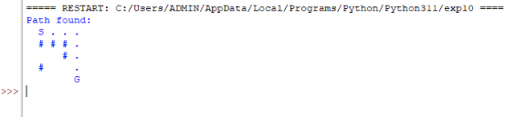

6)AIM:Write the python program for Vacuum Cleaner problem. 

ALGORITHM: 

1\.Initialize: Define the environment (dirty and clean squares) and vacuum’s initial position. 

2\.Generate Actions: Define possible actions (move, clean). 

3\.Apply Actions: Simulate the result of actions on the environment. 

4\.Check for Goal: Verify if all squares are clean. 

5\.Plan Path: Use search algorithms (BFS, DFS) to determine the sequence of actions to clean all squares. PROGRAM: 

import random 

class VacuumCleaner: 

`    `def \_\_init\_\_(self, grid\_size): 

`        `self.grid\_size = grid\_size 

`        `self.grid = [['dirty' if random.random() < 0.3 else 'clean' for \_ in range(grid\_size)] for \_ in range(grid\_size)] 

`        `self.x = random.randint(0, grid\_size - 1) 

`        `self.y = random.randint(0, grid\_size - 1) 

`        `self.cleaned\_cells = 0 

`    `def print\_grid(self): 

`        `for row in self.grid: 

`            `print(' '.join(row)) 

`        `print() 

`    `def move(self, direction): 

`        `if direction == 'up' and self.x > 0: 

`            `self.x -= 1 

`        `elif direction == 'down' and self.x < self.grid\_size - 1:             self.x += 1 

`        `elif direction == 'left' and self.y > 0: 

`            `self.y -= 1 

`        `elif direction == 'right' and self.y < self.grid\_size - 1: 

`            `self.y += 1 

`    `def clean(self): 

`        `if self.grid[self.x][self.y] == 'dirty': 

`            `self.grid[self.x][self.y] = 'clean' 

`            `self.cleaned\_cells += 1 

`    `def get\_possible\_moves(self): 

`        `moves = [] 

`        `if self.x > 0: 

`            `moves.append('up') 

`        `if self.x < self.grid\_size - 1: 

`            `moves.append('down') 

`        `if self.y > 0: 

`            `moves.append('left') 

`        `if self.y < self.grid\_size - 1: 

`            `moves.append('right') 

`        `return moves 

`    `def run(self): 

`        `while self.cleaned\_cells < sum(row.count('dirty') for row in self.grid):             self.clean() 

`            `possible\_moves = self.get\_possible\_moves() 

`            `if possible\_moves: 

`                `self.move(random.choice(possible\_moves)) 

def main(): 

`    `grid\_size = 5 

`    `vacuum = VacuumCleaner(grid\_size)     

`    `print("Initial Grid:") 

`    `vacuum.print\_grid() 

`    `vacuum.run() 

`    `print("Final Grid:") 

`    `vacuum.print\_grid() 

`    `print(f"Total cleaned cells: {vacuum.cleaned\_cells}") if \_\_name\_\_ == "\_\_main\_\_": 

`    `main() 

**OUTPUT** 

**7)AIM:**Breadth-First Search (BFS) 

ALGORITHM: 

1\.Initialize: Start from the initial node and add it to a queue. 2.Explore Nodes: Dequeue a node and explore its neighbors. 3.Check for Goal: If a neighbor is the goal, return the path. 4.Queue Neighbors: Add unvisited neighbors to the queue. 5.Repeat: Continue until the queue is empty or the goal is found. 

PROGRAM: 

from collections import deque 

def bfs(graph, start\_node): 

`    `visited = set() 

`    `queue = deque([start\_node]) 

`    `traversal\_order = [] 

`    `while queue: 

`        `node = queue.popleft() 

`        `if node not in visited: 

`            `visited.add(node) 

`            `traversal\_order.append(node)             for neighbor in graph[node]: 

`                `if neighbor not in visited: 

`                    `queue.append(neighbor)     return traversal\_order 

def main(): 

`    `graph = { 

`        `'A': ['B', 'C'], 

`        `'B': ['A', 'D', 'E'], 

`        `'C': ['A', 'F'], 

`        `'D': ['B'], 

`        `'E': ['B', 'F'], 

`        `'F': ['C', 'E'] 

`    `} 

`    `start\_node = 'A' 

`    `print("Graph:") 

`    `for node, neighbors in graph.items(): 

`        `print(f"{node}: {neighbors}") 

`    `print("\nBFS Traversal Order:") 

`    `traversal\_order = bfs(graph, start\_node)     print(traversal\_order) 

if \_\_name\_\_ == "\_\_main\_\_": 

`    `main() 

**output** 

**8)AIM:**Depth-First Search (DFS) 

ALGORITHM: 

1\.Initialize: Start from the initial node and add it to a stack. 

2\.Explore Nodes: Pop a node from the stack and explore its neighbors. 3.Check for Goal: If a neighbor is the goal, return the path. 

4\.Stack Neighbors: Add unvisited neighbors to the stack. 

5\.Repeat: Continue until the stack is empty or the goal is found. 

PROGRAM: 

def dfs\_recursive(graph, node, visited=None):     if visited is None: 

`        `visited = set() 

`    `visited.add(node) 

`    `return [node] + [n for neighbor in graph[node] if neighbor not in visited for n in dfs\_recursive(graph, neighbor, visited)] 

def dfs\_iterative(graph, start\_node): 

`    `visited, stack, order = set(), [start\_node], []     while stack: 

`        `node = stack.pop() 

`        `if node not in visited: 

`            `visited.add(node) 

`            `order.append(node) 

`            `stack.extend(reversed(graph[node])) 

`    `return order 

def main(): 

`    `graph = { 

`        `'A': ['B', 'C'], 

`        `'B': ['A', 'D', 'E'], 

`        `'C': ['A', 'F'], 

`        `'D': ['B'], 

`        `'E': ['B', 'F'], 

`        `'F': ['C', 'E'] 

`    `} 

`    `start\_node = 'A' 

`    `print("Graph:") 

`    `for node, neighbors in graph.items(): 

`        `print(f"{node}: {neighbors}") 

`    `print("\nDFS Traversal Order (Recursive):")     print(dfs\_recursive(graph, start\_node)) 

`    `print("\nDFS Traversal Order (Iterative):")     print(dfs\_iterative(graph, start\_node)) 

if \_\_name\_\_ == "\_\_main\_\_": 

`    `main() 

**output** 

**9)AIM:**Travelling Salesman Problem (TSP) ALGORITHM: 

1\.Initialize: Define cities and distances between them. 

2\.Generate Permutations: Create all possible routes. 

3\.Calculate Costs: Compute the total distance for each route. 

4\.Find Minimum: Identify the route with the minimum total distance. 5.Return Solution: Return the shortest route and its cost. 

PROGRAM: 

from itertools import permutations 

def calculate\_path\_cost(distance\_matrix, path): 

`    `cost = 0 

`    `for i in range(len(path) - 1): 

`        `cost += distance\_matrix[path[i]][path[i + 1]] 

`    `cost += distance\_matrix[path[-1]][path[0]] 

`    `return cost 

def tsp\_bruteforce(distance\_matrix): 

`    `n = len(distance\_matrix) 

`    `cities = list(range(n)) 

`    `min\_cost = float('inf') 

`    `best\_path = [] 

`    `for perm in permutations(cities): 

`        `current\_cost = calculate\_path\_cost(distance\_matrix, perm)         if current\_cost < min\_cost: 

`            `min\_cost = current\_cost 

`            `best\_path = perm 

`    `return min\_cost, best\_path 

def main(): 

`    `distance\_matrix = [ 

`        `[0, 10, 15, 20], 

`        `[10, 0, 35, 25], 

`        `[15, 35, 0, 30], 

`        `[20, 25, 30, 0] 

`    `] 

`    `min\_cost, best\_path = tsp\_bruteforce(distance\_matrix)     print("Optimal Path:", best\_path) 

`    `print("Minimum Cost:", min\_cost) 

if \_\_name\_\_ == "\_\_main\_\_": 

`    `main() 

OUTPUT: 

**10)AIM:**A\* Algorithm 

ALGORITHM: 

1\.Initialize: Start from the initial state, define the goal, and create open and closed lists. 2.Generate Successors: Create possible moves from the current state. 

3\.Evaluate Cost: Compute the cost (g) and heuristic (h) for each successor. 

4\.Select Node: Choose the node with the lowest f = g + h from the open list. 

5\.Check for Goal: If the node is the goal, return the path. 

PROGRAM: 

import heapq 

def heuristic(a, b): 

`    `return abs(a[0] - b[0]) + abs(a[1] - b[1]) 

def astar(grid, start, goal): 

`    `rows, cols = len(grid), len(grid[0]) 

`    `open\_set = [(0 + heuristic(start, goal), 0, start)] 

`    `came\_from = {} 

`    `cost\_so\_far = {start: 0} 

`    `while open\_set: 

`        `\_, current\_cost, current = heapq.heappop(open\_set) 

`        `if current == goal: 

`            `path = [] 

`            `while current in came\_from: 

`                `path.append(current) 

`                `current = came\_from[current] 

`            `return path[::-1] + [goal] 

`        `for dx, dy in [(-1, 0), (1, 0), (0, -1), (0, 1)]: 

`            `neighbor = (current[0] + dx, current[1] + dy) 

`            `if 0 <= neighbor[0] < rows and 0 <= neighbor[1] < cols and grid[neighbor[0]][neighbor[1]] == 0:                 new\_cost = current\_cost + 1 

`                `if neighbor not in cost\_so\_far or new\_cost < cost\_so\_far[neighbor]: 

`                    `cost\_so\_far[neighbor] = new\_cost 

`                    `priority = new\_cost + heuristic(neighbor, goal) 

`                    `heapq.heappush(open\_set, (priority, new\_cost, neighbor)) 

`                    `came\_from[neighbor] = current 

`    `return [] 

def print\_grid(grid, path): 

`    `path\_set = set(path) 

`    `for i, row in enumerate(grid): 

`        `for j, cell in enumerate(row): 

`            `if (i, j) == path[0]: print('S', end=' ') 

`            `elif (i, j) == path[-1]: print('G', end=' ') 

`            `elif (i, j) in path\_set: print('.', end=' ') 

`            `else: print('#' if cell == 1 else ' ', end=' ') 

`        `print() 

def main(): 

`    `grid = [ 

`        `[0, 0, 0, 0, 0], 

`        `[0, 1, 1, 1, 0], 

`        `[0, 0, 0, 1, 0], 

`        `[0, 1, 0, 0, 0], 

`        `[0, 0, 0, 0, 0] 

`    `] 

`    `start, goal = (0, 0), (4, 4) 

`    `path = astar(grid, start, goal)     if path: 

`        `print("Path found:") 

`        `print\_grid(grid, path) 

`    `else: 

`        `print("No path found.") 

if \_\_name\_\_ == "\_\_main\_\_": 

`    `main() 

**OUTPUT:** 

